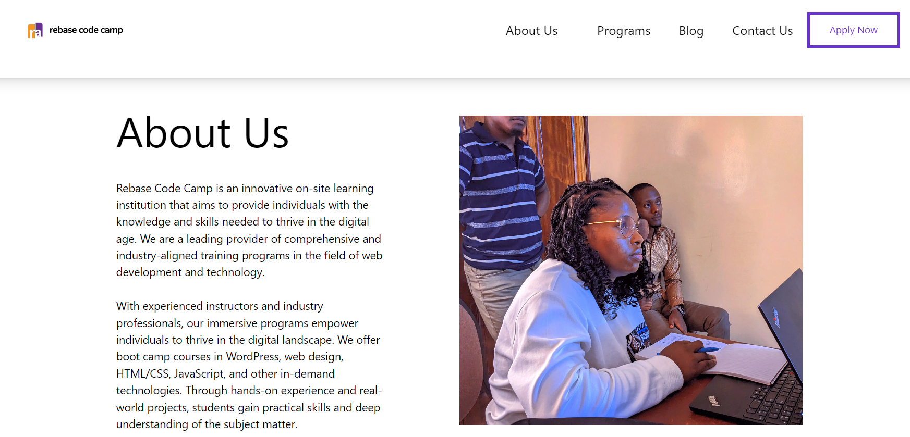
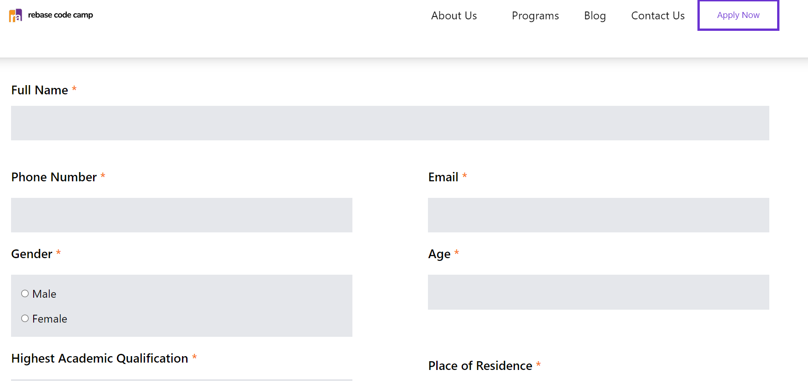
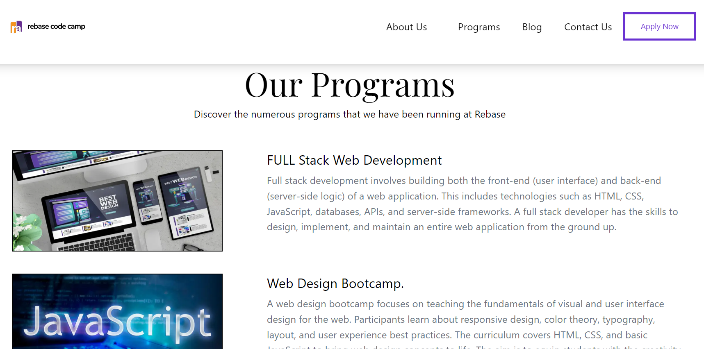
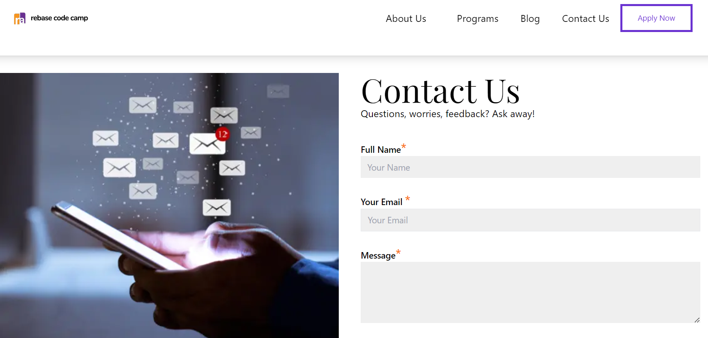
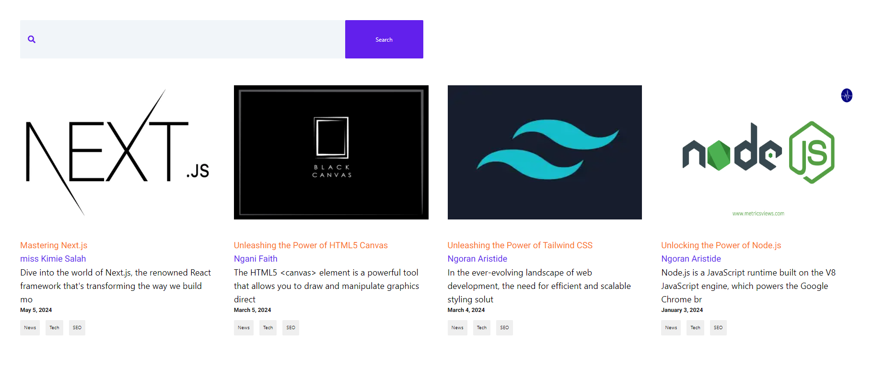

# D&G Collection

This is a web site for a school where you can apply get in touch or may be contact the school for more information about the school.

## Features

1 Application Page
2 Contact-Us
3 FAQS Page
4 Programs Page
5 Blog Page

## Technologies Used

Front-end: Next.js, Tailwind
Back-end: CMS-SANITY

## Screen Shots

Here are some screenshots of the project

## About Page



## Application Form



## Programs



## contact Us



## Blogs



### START APP

- To start application, run

  ```bash
      $ npm run dev # to start development server
  ```

- [live deployment](https://rebase-cc-frontend-git-feat-sa-780849-ngoran-aristides-projects.vercel.app/)
